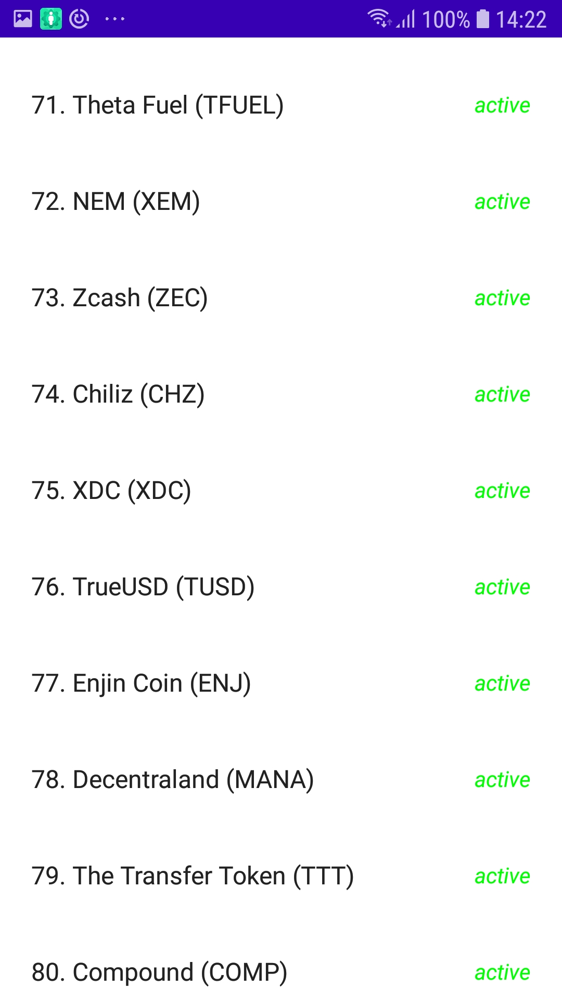
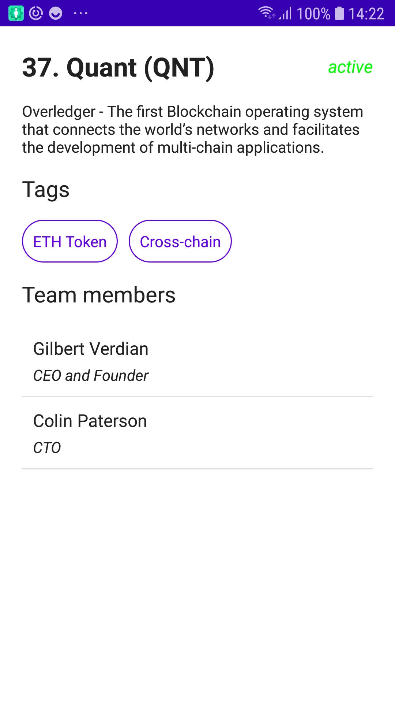

# Crypto-Currency
A clean architecture app using Jetpack Compose.

## The Brief

App that lists crypto currencies. 

## Architecture & Libraries
    - MVVM
    - Use Cases
    - Compose
    - Local & Remote Data Sources
    - Retrofit
    - Dependency Injection - Dagger-Hilt
    - Kotlin Coroutines
    - Flow
    
## App preview:

Image #1            |  Image #2             |  Image #3
:-------------------------:|:----------------------------:|:----------------------------:
    |       |   